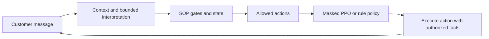

# Goaly — constrained agent RL harness

An insurance claims scenario for studying how a learned dialogue policy behaves
inside a deterministic business workflow. The project demonstrates five linked
skills: formalizing SOP rules, training a masked policy, debugging environment
semantics, measuring outcomes, and connecting dialogue actions to actual speech.

| Capability | Implementation | Evidence |
|---|---|---|
| SOP constraints | Identity and claim ownership gates, four ordered phases, consent and action masks | 33 scenario benchmark with 650 assertions |
| Policy training | 30 observable features, masked Actor-Critic, GAE and PPO | Versioned checkpoints and training logs |
| Causal interaction | Distinct action renderer; caller reacts to speech rather than action labels | Reset, snapshot, speech and emotion regression tests |
| Reward and evaluation | Grounded-answer completion, reason-based escalation, paired policy comparisons | Multi-seed audit, profile slices and reproducible JSON reports |
| Bounded conversation | Empathy, gate explanations, alternate PII, grounded claim answers, send/skip choice | Customer UI and exported synthetic RL dialogue trajectories |

Customer chat now runs the selected **rule / PPO seed 42 / PPO seed 7** controller.
The language setting is independent: offline uses the bounded interpreter and
composer; a configured API model interprets broader wording, resolves document
references and arranges approved facts. The model does not authorize claim
access, invent facts, or grant email consent.
DPO outputs are preference **data**; no DPO model has been trained.



The acceptance target is a complete, useful conversation: remember the early
case hint, verify three matching fields, answer contextual follow-ups without
making the customer start over, offer alternatives grounded in records, and
respect send or skip. A short call or high training reward alone is insufficient.
See [the customer runtime and policy evidence](docs/CUSTOMER_RUNTIME.md).

## Run the demo

Python 3.11 is recommended.

~~~bash
python3 -m venv .venv
source .venv/bin/activate
pip install -r requirements.txt
./run.sh
~~~

Open <http://127.0.0.1:8080>. Offline mode works without credentials.
Use **Settings** to choose the controller. Expand **This response** below the
conversation to inspect the executed action, permitted alternatives, actual
probabilities, checkpoint identity and any fallback. A mandatory SOP response
has no sampled policy action. No illegal action is made available to PPO.

Open **Developer lab** in the header, or <http://127.0.0.1:8080/lab>, for the
current customer-policy report and the original version-3 simulator experiment.
The latter runs rule, random and two historical PPO policies against the same
synthetic caller; its weights and metrics are separate from customer version 4.
The lab exposes checkpoint hashes, legal action probabilities, dialogue replay,
reward components and JSON downloads. Customer sessions and lab runs are separate.
For a live model, open **API settings**, select **Live model**, and enter an
OpenAI-compatible API token, base URL and model name. Tokens stay in session
server memory; they are not saved in browser storage.

~~~bash
cp .env.example .env
docker compose up --build
~~~

Compose uses the same address. Set optional AI_API_KEY, AI_BASE_URL, AI_MODEL and
PORT in .env. The image includes training scripts and checked-in RL artifacts.
All identities are synthetic; email and human transfer are simulated.

Start with a plain-language topic button, or **Not sure where to start** for an
explanation. **Verify using a form** opens a blank form with a native date picker,
field feedback and explicit sample filling. Submitted corrections are reverified;
one or two matching details never advance the SOP. Common business spelling
errors are tolerated without fuzzy-matching identity or interpreting misspelled
consent as approval. Available claim choices come only from the verified owner.

The text box is the primary input. Optional suggestions are collapsed until
needed; they send ordinary messages rather than bypassing dialogue. Try
**What documents do I need? → What is the second one? → I can’t get it. → Can I
send photos? → And the deadline?** The answer keeps the currently discussed
document in context and clarifies when the reference is ambiguous. Unconfirmed
photo formats are identified as unconfirmed, not promised acceptable.

Under **Testing the demo?**, try **Margaret’s January claim**, ask about missing documents, then select
**That answers my question** and choose **send** or **skip**. The inspector shows
verification, remembered hints, claim access, consent and replay. You can also
enter three identity fields in the verification card.

Free-text endings such as **That answers my question** also open the summary
choice. **How this works** opens the inspector and replay. An accompanying follow-up question keeps the conversation open. Grounded
answers start concise and retain required document conditions; ask for details
to expand them. See the [five-minute reviewer guide](docs/REVIEWER_GUIDE.md).
For a plain-language explanation of the UI and current technical checks, see
[the customer usability and technical review](docs/UX_AND_TECHNICAL_REVIEW.md).

## Train the customer conversation policy

Version 4 uses the **same mask and action executor as customer chat**. Its
reactive caller reads the actual reply, asks multiple document questions, can
repeat an unanswered concern, and makes its own explicit email choice. Reward
charges ignoring distress and unnecessary verification explanations based on
what was actually said. Completion requires answering the caller’s questions
and resolving consent, not merely reaching a terminal phase.

```bash
# Fresh runs on the current scenario distribution (not historical warm starts).
OMP_NUM_THREADS=1 MKL_NUM_THREADS=1 python3 train_customer_policy.py --timesteps 60000 --seed 42
OMP_NUM_THREADS=1 MKL_NUM_THREADS=1 python3 train_customer_policy.py --timesteps 60000 --seed 7
OMP_NUM_THREADS=1 python3 -m eval.customer_policy_comparison --assert-thresholds
```

The customer checkpoints live under `artifacts/customer_policy/`; the original
weights remain available for a before/after comparison using the same current
executor. See [the comparison JSON](artifacts/customer_policy/comparison.json)
and [runtime explanation](docs/CUSTOMER_RUNTIME.md). The delivered weights each
received three 20,000-step segments (60,288 actual steps), with a scenario
coverage revision before the final segment. A fresh 60k run above is a different
experiment. [Exact history, source overlays and warm-start instructions](artifacts/customer_policy/README.md)
retain both unsuccessful intermediate runs and the final checkpoints.

On the seven development scenarios, both original PPO checkpoints complete 3/7
cases, cause 2/7 unresolved handoffs and time out on 1/7. Both new checkpoints
complete 6/7 with one expected no-match handoff, matching the rule baseline;
measured violations, timeouts and ignored distress are zero. Mean policy actions
are 8.286 for rules and both new seeds; mean assistant responses are 9.143 for
rules and 9.286 for PPO. This fixes the earlier multi-turn adaptation weakness;
it does **not** demonstrate superiority over rules. The scenarios were inspected
during language-routing development and are not a blind human evaluation.
The two experiments have separate environment versions and must not have their
scores pooled.

## Reproduce the original RL experiment

Environment version 3 and feature schema version 2 correct the previous reset,
empty-case, action/speech, escalation and preference-pair issues. The reward also
charges a small cost for ignoring observable distress, without granting an
empathy bonus that can be collected repeatedly.
Old 20-feature checkpoints are rejected explicitly.

~~~bash
OMP_NUM_THREADS=1 MKL_NUM_THREADS=1 python3 train_ppo.py \
  --timesteps 50000 --device cpu --seed 42

OMP_NUM_THREADS=1 MKL_NUM_THREADS=1 python3 train_ppo.py \
  --timesteps 50000 --device cpu --seed 7 \
  --save-path artifacts/seed7/ppo_policy.pt \
  --metrics-path artifacts/seed7/ppo_training_metrics.json

OMP_NUM_THREADS=1 MKL_NUM_THREADS=1 python3 train_ppo.py \
  --timesteps 25000 --device cpu --seed 42 --warm-start artifacts/ppo_policy.pt

OMP_NUM_THREADS=1 MKL_NUM_THREADS=1 python3 train_ppo.py \
  --timesteps 25000 --device cpu --seed 7 --warm-start artifacts/seed7/ppo_policy.pt \
  --save-path artifacts/seed7/ppo_policy.pt \
  --metrics-path artifacts/seed7/ppo_training_metrics.json

OMP_NUM_THREADS=1 python3 -m eval.audit_rl
~~~

Each seed requests 50,000 initial steps plus 25,000 additional steps; complete
rollout batches produce 50,048 + 25,088 = 75,136 actual steps. Warm starts retain
policy, optimizer and history, and explicitly reset the RNG and current episode.
They are reproducible training segments, not exact mid-episode resumptions.
The audit checks both training seeds on train, validation, test and canonical
demo splits. It records checkpoint hashes, measured results, causal regression
probes, and the first action for each conversational style.

- [Readable audit report](artifacts/rl_audit.md) / [complete JSON](artifacts/rl_audit.json)
- [Canonical policy comparison](artifacts/policy_comparison.json)
- [Training metrics, seed 42](artifacts/ppo_training_metrics.json)
- [Training metrics, seed 7](artifacts/seed7/ppo_training_metrics.json)

The final audit passes for both seeds on all four splits. On the balanced
28-episode canonical set, both achieve 75% case completion and 25% appropriate
handoff, with zero premature exits, truncations or measured constraint
violations. Seed 42 averages 4.25 turns, matching the rule reference; seed 7
averages 7.00 turns. The result supports task competence, while efficiency still
varies across seeds. It does not establish superiority over the rule baseline.

~~~bash
python3 -m eval.policy_comparison --split test --episodes 28 \
  --json-output artifacts/policy_test.json --assert-thresholds
~~~

Success means a grounded answer was actually delivered and the optional email
choice was resolved. Appropriate escalation is reported separately. Consistent
timeouts are counted as truncations, not erroneous terminal states. Acceptance
requires no PPO violations, premature exits or truncations; verified completed
cases; task outcomes at least matching the rule baseline; and reward above
random. The command exits nonzero if these checks fail.

## Preference data

~~~bash
python3 -m eval.generate_dpo_pairs --num-pairs 50 --min-reward-delta 0.1
~~~

Both candidates start at the same restored environment and caller state. They
use a common rule policy for the remaining conversation. Preference is based on
discounted continuation return, not only the immediate reward.
Every retained pair has different reply text and a return margin of at least 0.1.
The measured minimum is 0.199. A threshold of 1 excluded smaller efficiency and
dialogue-quality differences, leaving all 50 rejected replies as premature
escalations. The current data includes six rejected action types, with 23/50
premature escalations and 27/50 other alternatives.

The JSONL rows contain string prompt/chosen/rejected fields plus action labels,
returns and state hashes. Grouping by identity/style keeps related examples in
one split: 32 train, 10 validation, 8 test in the current 50-pair artifact.
See [manifest](artifacts/dpo_manifest.json).

## Verification and interpretation

~~~bash
python3 -m pytest -q
python3 -m eval.eval_benchmark
~~~

The final local suite passes 292 tests. The delivery report records the commands,
source checks and browser evidence for this checkout.
Tests include same-seed reset, snapshot replay,
history order, empty-case features, emotional observations, speech-sensitive
caller behavior, false escalation, send/skip and preference group isolation.

Additional acceptance commands:

~~~bash
# Start the app first; browser tooling is optional.
python3 -m pip install playwright==1.58.0
python3 -m playwright install chromium
python3 -m eval.browser_acceptance --require-customer-report

# Configure AI_API_KEY, AI_BASE_URL and AI_MODEL in .env.
python3 -m eval.live_acceptance

# Controlled input ablation: four fresh runs, equal budgets.
OMP_NUM_THREADS=1 MKL_NUM_THREADS=1 python3 -m eval.emotion_ablation \
  --timesteps 25000 --seeds 42 7
~~~

Browser evidence covers customer chat and RL Lab at desktop and 390px phone
widths. The live HTTP suite covers workflow and multi-turn reference scenarios: missing credentials produce
`not_run` with exit code 2, and provider fallback cannot count as a pass.
Read [live status](artifacts/customer_runtime/live_acceptance.json) before claiming provider acceptance.

The [emotion ablation](artifacts/emotion_ablation/report.md) zeros only feature
dimensions 20–24, keeping masks, rewards, profiles, architecture and budget fixed.
Both paired seeds show fewer training-split truncations with full features, but
held-out task success is unchanged. All four runs are retained, including failures.
These fresh 25k runs are separate from the 75k delivery checkpoints and do not
establish statistical significance.
The exact hashed training inputs are retained in
[the source snapshot](artifacts/emotion_ablation/training_source.zip) and
[manifest](artifacts/emotion_ablation/source_manifest.json), so later dialogue
improvements do not silently change the recorded experiment.

GitHub Actions builds the Docker image, runs tests, the benchmark and two-seed
audit, then checks desktop/mobile flows. The workflow makes no paid model calls;
its configuration is not evidence of a completed CI run.

An earlier audit failure is documented in
[experiment history](docs/EXPERIMENT_HISTORY.md): seed 42
completed tasks but did not acknowledge frustration first. The current reward
revision and two-seed rerun address that measured weakness. Read the current
audit result to check acceptance; checkpoint selection does not hide a failed seed.
The version-3 50k audit is also retained under
[interaction_cost_50k](artifacts/interaction_cost_50k/rl_audit.json): both seeds
passed the empathy probes, but seed 7 timed out on a no-match training scenario.
Both seeds receive the same additional 25k budget; acceptance gates remain unchanged.

The simulator understands a finite text protocol; it is not a human or a general
language model. Training and test reuse synthetic identities, while holding out
identity/style/scenario combinations. Repeating four templates 50 times does not
create 50 independent human conversations. Two training seeds are a stability
check, not a statistical claim about deployment performance.

Action masking enforces safety boundaries; zero sampled violations do not prove
that PPO learned safety. The UI's live model proposes bounded interpretations
and a validated fact presentation plan; protected replies retain complete
authorized facts and their conditions. These experiments do not measure
human satisfaction or prove free-form conversational generalization.

See [walkthrough](walkthrough.md) for the environment contract and design choices.
