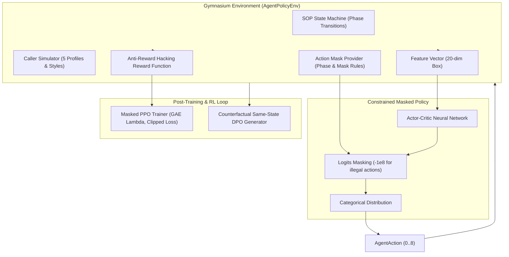
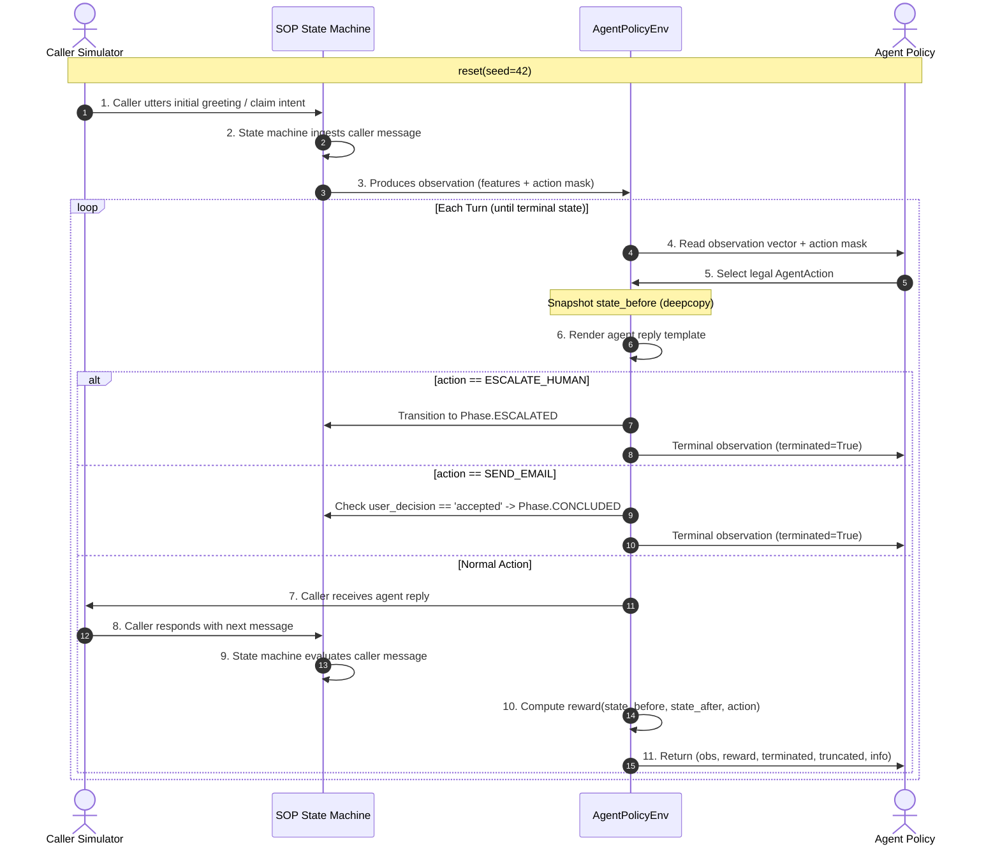

# Goaly RL Closed-Loop Infrastructure & Evaluation Walkthrough

This document provides a comprehensive technical walkthrough of the constrained Reinforcement Learning (RL) environment, Masked PPO algorithm, counterfactual DPO preference dataset generation, and multi-policy evaluation arena in **Goaly**.

---

## 1. System Architecture Diagram



---

## 2. Agent/Caller Interaction Timing & State Machine

The interaction loop follows a strict, causal sequence to eliminate state leaks and illegal termination transitions:



### Key Correctness Invariants:
1. **Terminal State Invariant**: `terminated is True` **only when** `state.phase in {CONCLUDED, ESCALATED}`. Illegal combinations such as `phase == RESOLVE_INTENT and terminated == True` are strictly impossible.
2. **Deepcopied Pre-State**: `state_before` is captured via deepcopy before caller simulation to prevent mutation leak.
3. **Formal Escalation**: `ESCALATE_HUMAN` mutates `state.phase = Phase.ESCALATED`, sets `terminated = True`, `truncated = False`, and records `info["termination_reason"] = "agent_escalation"`.
4. **Consent-Gated Settlement**: `SEND_EMAIL` is masked out unless `state.phase == Phase.POST_PROCESS` and `state.post_process.user_decision == "accepted"`. Upon success, `state.phase = Phase.CONCLUDED` and `terminated = True`.

---

## 3. Action Space & Per-Phase Action Masking

The action space consists of 9 discrete actions (`spaces.Discrete(9)`):

| Index | Action Name | Allowed Phases | Conditions / Physical Blocking |
|:---:|---|---|---|
| 0 | `ACK_EMOTION` | All active phases | Empathy / de-escalation |
| 1 | `ASK_IDENTITY_FIELD` | `VERIFY_ID`, `RESOLVE_INTENT` | Requests a missing PII field |
| 2 | `EXPLAIN_VERIFICATION_GATE` | `VERIFY_ID`, `RESOLVE_INTENT` | Explains why protected details require verification |
| 3 | `RESOLVE_INTENT` | `RESOLVE_INTENT`, `PROCESS_CASE` | Confirms the caller's goal |
| 4 | `ASK_CLAIM_CLARIFICATION` | `RESOLVE_INTENT`, `PROCESS_CASE` | Requests bounded case detail |
| 5 | `ANSWER_GROUNDED` | `PROCESS_CASE` | **Physically blocked** until identity is verified |
| 6 | `OFFER_EMAIL_SUMMARY` | `PROCESS_CASE`, `POST_PROCESS` | Offers an optional summary email |
| 7 | `SEND_EMAIL` | `POST_PROCESS` | **Strictly blocked** unless `user_decision == "accepted"` |
| 8 | `ESCALATE_HUMAN` | All active phases | Transfers the caller; penalized when unprovoked |

Masking is enforced structurally at the logits layer:
$$\text{logits}_{\text{masked}}(a) = \begin{cases} \text{logits}(a) & \text{if } \text{mask}(a) = 1 \\ -10^8 & \text{if } \text{mask}(a) = 0 \end{cases}$$

`AgentPolicyEnv` exposes Gymnasium `action_space` and `observation_space` and
accepts either an integer action index or an `AgentAction`. Since illegal
actions are deliberately rejected at the environment boundary, the generic
Gymnasium checker (which samples unmasked actions) must be replaced with a
mask-aware sampler for this constrained environment.

---

## 4. Anti-Reward Hacking Reward Structure

To eliminate reward hacking (e.g. premature escalation to bypass verification), the reward function penalizes premature exits and strongly rewards complete resolution:

| Event / Transition | Reward | Rationale |
|---|:---:|---|
| Per-turn step penalty | $-0.1$ | Encourages concise resolution |
| Newly verified PII field | $+1.0$ | Rewards progress towards identity verification |
| Memorized context slot | $+0.5$ | Rewards gathering case details |
| Advancing to new Phase | $+2.0$ | Rewards forward progress along SOP pipeline |
| Grounded answer provided | $+1.0$ | Rewards compliant query fulfillment |
| Normal completion (`CONCLUDED`) | $+10.0$ | Primary task success reward |
| Appropriate human escalation | $+1.0$ | Grounded escalation when caller is hostile/escalating |
| Premature human escalation | $-3.0$ | **Eliminates premature escalation exploit** |
| Max turns truncation | $-5.0$ | Penalizes wandering / stalling |
| Structural safety violation | $-100.0$ | Hard constraint violation (never offset by positive rewards) |

Every step returns granular info metadata:
```json
{
  "task_success": true,
  "appropriate_escalation": false,
  "premature_termination": false,
  "constraint_violation": false,
  "reward_components": {
    "step_cost": -0.1,
    "pii_reward": 1.0,
    "context_reward": 0.0,
    "phase_reward": 2.0,
    "grounded_reward": 0.0,
    "completion_reward": 10.0,
    "escalation_reward": 0.0,
    "truncation_penalty": 0.0,
    "safety_penalty": 0.0
  }
}
```

---

## 5. Mathematical Formulation: GAE and Masked PPO

### Generalized Advantage Estimation (GAE)
Let $r_t$ be the step reward, $V(s_t)$ the value estimate, and $d_t \in \{0, 1\}$ the done indicator for transition $t$. The temporal difference residual is:
$$\delta_t = r_t + \gamma \, V(s_{t+1}) (1 - d_t) - V(s_t)$$

The GAE advantage $\hat{A}_t$ is computed backwards:
$$\hat{A}_t = \delta_t + \gamma \lambda (1 - d_t) \hat{A}_{t+1}$$

Target returns are:
$$\hat{R}_t = \hat{A}_t + V(s_t)$$

> **GAE Off-by-One Fix**: The bootstrap indicator uses $1 - d_t$ (not $d_{t+1}$), ensuring advantages never bleed across episode boundaries into preceding episodes.

### Masked PPO Objective
$$\mathcal{L}^{\text{CLIP}}(\theta) = \hat{\mathbb{E}}_t \left[ \min\left( \rho_t(\theta)\hat{A}_t, \, \text{clip}(\rho_t(\theta), 1-\epsilon, 1+\epsilon)\hat{A}_t \right) \right]$$
where $\rho_t(\theta) = \frac{\pi_\theta(a_t \mid s_t, \text{mask}_t)}{\pi_{\theta_{\text{old}}}(a_t \mid s_t, \text{mask}_t)}$.

Combined loss with value function clipping and entropy regularization:
$$\mathcal{L}^{\text{PPO}}(\theta) = -\mathcal{L}^{\text{CLIP}}(\theta) + c_1 \mathcal{L}^{\text{VF}}(\theta) - c_2 \mathcal{S}[\pi_\theta](s_t)$$

---

## 6. Counterfactual Same-State DPO Pair Generation

To construct preference pairs for Direct Preference Optimization (DPO), data is generated via **same-state counterfactual branching**:

```
        State S at turn t
               |
        +------+------+
        |             |
   Rule-Based     Alternative
     Action         Action
   (Chosen)       (Rejected)
        |             |
   Rollout A     Rollout B
```

### Dataset Invariants Enforced:
1. `chosen["prompt"] == rejected["prompt"]` (100% same-state context)
2. `chosen["phase"] == rejected["phase"]`
3. `chosen["verified_fields"] == rejected["verified_fields"]`
4. `chosen["action"] != rejected["action"]`
5. `reward_delta = chosen["reward"] - rejected["reward"] >= 1.0`
6. `chosen["violation"] == False`
7. Splits: **70% Train, 15% Validation, 15% Test**

---

## 7. Execution & Training Commands

### PPO Training (50,000 Steps on CPU)
```bash
python3 train_ppo.py \
  --timesteps 50000 \
  --device cpu \
  --seed 42 \
  --save-path artifacts/ppo_policy.pt \
  --metrics-path artifacts/ppo_training_metrics.json
```

### Multi-Policy Standard Arena Comparison
```bash
python3 -m eval.policy_comparison
```

### Same-State DPO Dataset Generation
```bash
python3 -m eval.generate_dpo_pairs --num-pairs 50 --output artifacts/dpo_pairs.jsonl
```

### Automated Unit & Benchmark Test Suite
```bash
pytest tests/ -v
python3 -m eval.eval_benchmark
```

---

## 8. Empirical Evaluation Results

*(Results populated from the 50-episode multi-profile standardized benchmark arena)*

| Evaluation Metric | `RuleBasedPolicy` | `RandomPolicy` | `PPO (Learned, 50k)` |
|---|:---:|:---:|:---:|
| **Terminal State Consistency** | **100.00%** | 98.00% | **100.00%** |
| **Constraint Violation Rate** | **0.00%** | **0.00%** | **0.00%** |
| **Premature Termination Rate** | **0.00%** | 40.00% | **0.00%** |
| **Goal Success Rate** | **76.00%** | 10.00% | **76.00%** |
| **Appropriate Escalation Rate** | **24.00%** | 48.00% | **24.00%** |
| **Clean Termination Rate** | **100.00%** | 98.00% | **100.00%** |
| **Truncation Rate** | **0.00%** | 2.00% | **0.00%** |
| **Mean Verified PII Fields** | **2.28** | 1.78 | **2.28** |
| **Mean Episode Turns** | 3.52 | 4.00 | **3.28** |
| **Mean Cumulative Reward** | **+13.53** | +2.44 | **+13.08** |

### Final Phase Distribution:
- **`RuleBasedPolicy`**: `CONCLUDED: 38 (76%)`, `ESCALATED: 12 (24%)`
- **`RandomPolicy`**: `CONCLUDED: 5 (10%)`, `ESCALATED: 44 (88%)`, `POST_PROCESS (truncated): 1 (2%)`
- **`PPO (Learned)`**: `CONCLUDED: 38 (76%)`, `ESCALATED: 12 (24%)`

The learned PPO agent matches the RuleBased policy's **terminal outcome distribution** across these 50 episodes (38 concluded, 12 escalated), while its surface action sequence can differ. It has 0% premature termination and 0% constraint violations in this fixture benchmark.

---

## 9. Known Limitations

1. **Simulated Caller Distribution**: The caller simulator provides 5 distinct psychological styles, but natural human conversations exhibit open-domain variability.
2. **Discrete 9-Action Space**: The policy selects higher-level dialogue acts; surface-level natural language generation is handled by template/LLM renderers.
3. **Reward Shaping Balance**: Step penalties ($-0.1$) vs completion reward ($+10.0$) require calibration to balance dialogue efficiency with conversational thoroughness.
4. **Offline DPO**: Pairs are extracted from counterfactual transitions rather than live human preference annotations.
